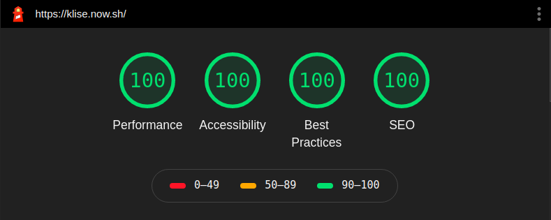

# Klisé

Klisé is minimalist Jekyll theme for running a personal site and blog running on Jekyll.<br>
For demo <a href="https://klise.now.sh" target="_blank" rel="noopener">klise.now.sh</a>

## Features

- [x] Light & Dark Mode support :waxing_crescent_moon:
- [x] Customizable (using `.scss`)
- [x] Responsive (desktop, tab and mobile)
- [x] Mobile First Design
- [x] SEO Optimized
- [x] Images of post Organized ([`jekyll-postfiles`](https://github.com/nhoizey/jekyll-postfiles))
- [x] Generate Sitemap ([`jekyll-sitemap`](https://github.com/jekyll/jekyll-sitemap))
- [x] RSS Feed ([`jekyll-feed`](https://github.com/jekyll/jekyll-feed))
- [x] Syntax Highlighter ([`rouge`](https://github.com/rouge-ruby/rouge))
- [x] Next & Previous Post
- [x] Comment layout, enable in frontmatter if you wish
- [x] Google analytics
- [x] HTML Minify ([`jekyll-compress-html`](https://github.com/penibelst/jekyll-compress-html))
- [x] W3C **Validated**
- [x] Lighthouse and PageSpeed **Passed**



## Backlogs

- [ ] Intergrated with PhotoSwipe.
- [ ] Add schema.org meta information.
- [ ] Transform class selector to BEM metodology.

## Installation

Run local server:

```bash
git clone https://github.com/piharpi/jekyll-klise.git
cd jekyll-klise
bundle install
bundle exec jekyll serve
```

Navigate to `localhost:4000`. You're Welcome, Fork and be Stargazer.

[](https://app.netlify.com/start/deploy?repository=https://github.com/piharpi/jekyll-klise) [](https://vercel.com/import/project?template=https://github.com/piharpi/jekyll-klise)

## Limitation

- Since [`jekyll-postfiles`](https://github.com/nhoizey/jekyll-postfiles#compatibility) plugin isn't supported by github pages, this cause will make your site problems, path broken or post images won't show up, you can host alternatively using likes [netlify.com](https://netlify.com), [vercel.com](https://vercel.com) or [surge.sh](https://surge.sh) services, which support 3rd party.

## Contributing

If you see any typos or formatting errors in a post, or want to helping reduce backlogs or any other issue that needs to be addressed, please do not hesitate to open a pull request and fix it!, please read [contributing](./CONTRIBUTING.md) before PR.

Yeaaa feel free to open a pull request.

## License

This project is open source and available under the [MIT License](LICENSE).
